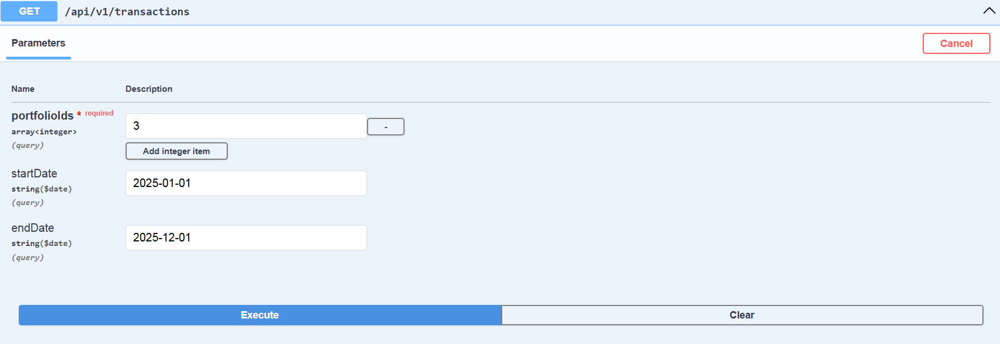

Tools used: 
Spring Boot 
Spring Boot Security 
Spring Doc 
H2 Database 
Lombok 
JUnit 
Mockito  

App uses the H2 in-memory database to store rest endpoint user credentials. 
Database is erased as soon as the application is stopped and recreated when application is started. 
Database console can be accessed using URL http://localhost:8080/h2-console when the application is running. 
All necessary information for logging into the H2 console can be found in application.properties file.  

SpringDoc is used to generate API docs. 
Documentation can be accessed using URL http://localhost:8080/swagger-ui.html when the application is running.  

How to run project: 
1) Add Tryme environment credentials to the application.properties file (graphql.service.username and graphql.service.password). 
2) Start the Spirng Boot app.  

Lombok is used to for code generation. Maven plugin is used to allow annotation processing, 
but if it fails for Intellij Idea, you should do the following: 
1) Install Lombok plugin 
2) Enable annotation processing: 
Preferences -> Build, Execution, Deployment -> Compiler -> Annotation Processors -> Enable annotation processing   

Rest endpoint credentials: 
Username: user 
Password: password123  

In order to make a request from Postman: 
1) Create a GET request 
2) Use http://localhost:8080/api/v1/transactions path 
3) In Authorization tab choose Basic Auth and use Rest endpoint credentials 
for Username and password 
4) In Params tab pass the parameters required, for example: 
   

Alternatively you can make request using SpringDoc http://localhost:8080/swagger-ui.html and choosing "Try It Out" option  
